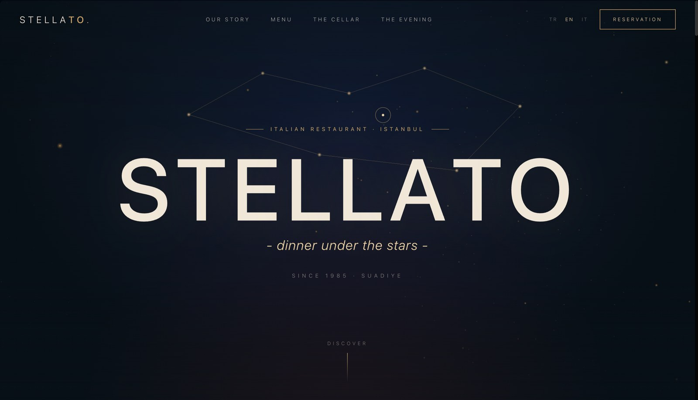
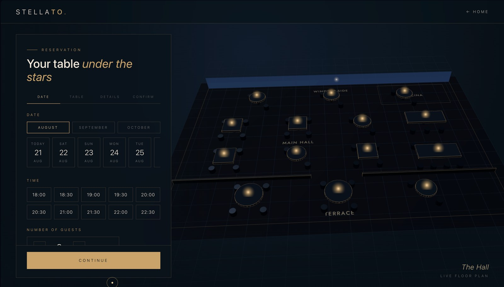
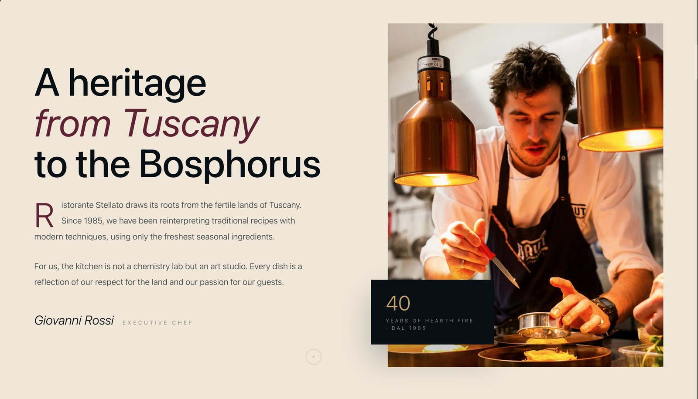
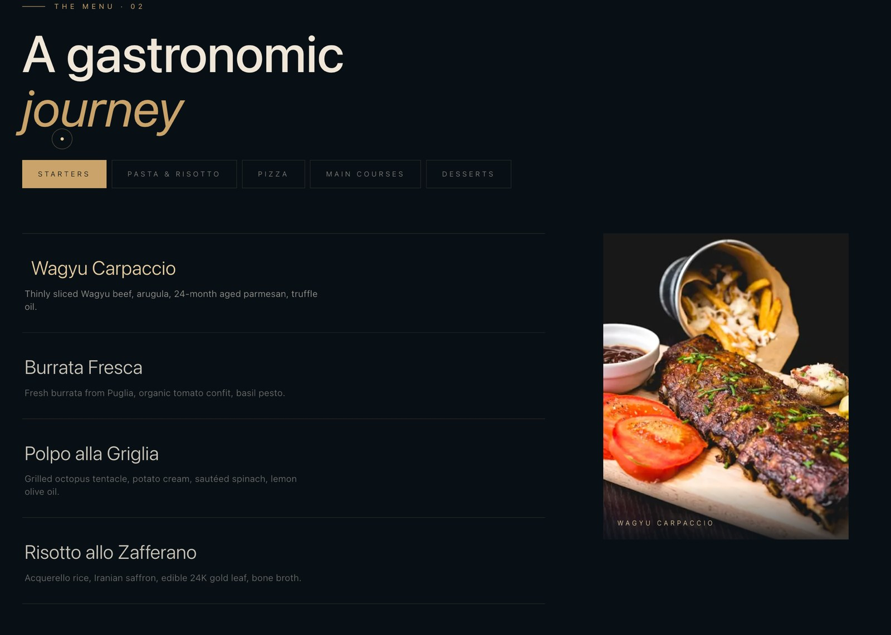
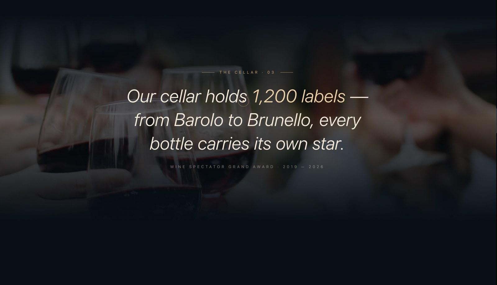
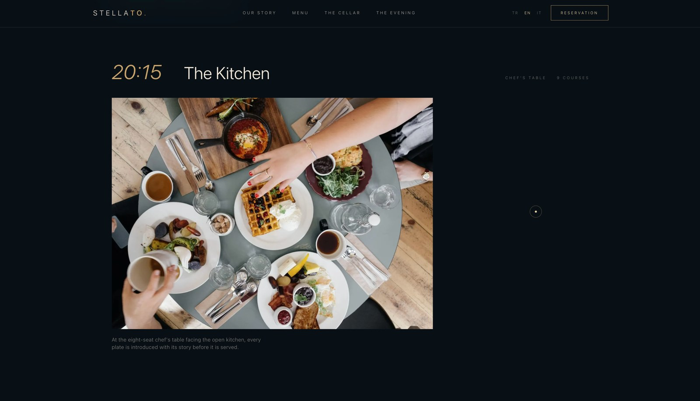
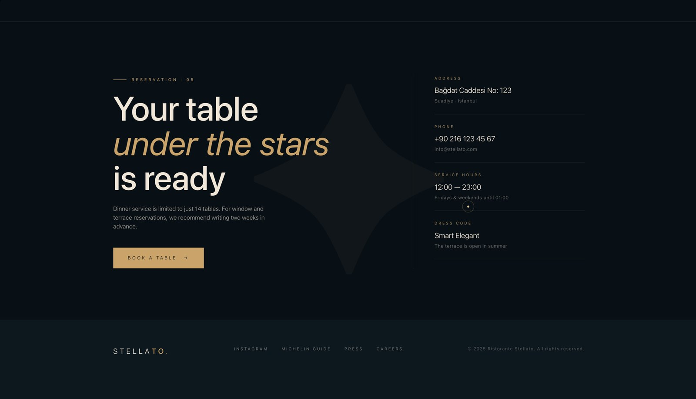

<h1 align="center">Ristorante Stellato</h1>

<p align="center">
  A full-stack restaurant reservation system with a cinematic front end —<br>
  a WebGL star field, a real 3D floor plan you pick your table from, and a real admin behind it.
</p>

<p align="center">
  <a href="https://ristorante-stellato-puum.vercel.app"><b>Live demo</b></a>
  &nbsp;·&nbsp;
  <a href="docs/features.md">Features</a>
  &nbsp;·&nbsp;
  <a href="docs/architecture.md">Architecture</a>
  &nbsp;·&nbsp;
  <a href="docs/development.md">Run it locally</a>
</p>

<p align="center">
  
  
  
  
  
  
  
  
</p>

---

## What it is

A reservation system for a fictional Istanbul restaurant, built end to end: guests
browse, pick a table and book; the restaurant sees every booking in a protected
dashboard. It is a portfolio project, but not a demo — it runs in production on
Vercel against MongoDB Atlas, with 53 tests, rate limiting and three languages.

The point of the project was to find out whether a genuinely cinematic front end
can sit on top of an ordinary, boring, correct backend without either side
suffering. The animation work is real Three.js and GSAP, not CSS transitions; the
backend is Server Actions, Zod validation and NextAuth v5.

## Three things worth looking at

### A 3D floor plan you actually book from



The reservation flow is four steps — date and time, table, details, confirm — and
step two is a WebGL model of the dining room. Tables with a lit candle are free,
dimmed ones are taken, and availability changes with the date and time you picked.
Selection is raycast against the actual geometry, and the camera moves with each
step. Availability sits behind a single `getAvailability()` seam, so swapping the
mock for live data touches one function.

### A star field that draws its own constellation



The landing page is a layered Three.js star field with mouse parallax, and the
constellation above the title draws itself as you scroll. Lenis drives smooth
scrolling and GSAP ScrollTrigger is synchronised to it, so reveals, curtains and
parallax all run off one timeline instead of fighting each other.

Under `prefers-reduced-motion` every WebGL scene and animation is switched off and
the content is served statically — the site stays fully usable.

### An admin that earns its keep

Behind NextAuth v5 and an unguessable route: statistics, live search, filtering and
pagination over every reservation. Guests get an email confirmation with a
personal follow-up link. Requests are rate limited per IP.

## Screens

<table>
<tr>
<td width="50%"><p align="center"><sub>Menu — filtered by course</sub></p></td>
<td width="50%"><p align="center"><sub>The cellar</sub></p></td>
</tr>
<tr>
<td width="50%"><p align="center"><sub>The evening, hour by hour</sub></p></td>
<td width="50%"><p align="center"><sub>Reservation and contact</sub></p></td>
</tr>
</table>

## Stack

**Front end** — Next.js 16 (App Router, React Compiler), React 19, TypeScript strict,
Tailwind v4 with an "ink & gold" token system, Three.js r128, GSAP 3.12 +
ScrollTrigger, Lenis, Framer Motion in the admin, Zod 4, a dependency-free i18n
context (TR / EN / IT), PWA with a service worker.

**Back end** — Next.js Server Actions, NextAuth v5 (credentials), MongoDB with
Mongoose, Zod schemas, Nodemailer over Gmail SMTP, IP-based rate limiting.

**Testing** — Vitest 4 with jsdom and React Testing Library. 53 unit and
integration tests across four suites: reservation validation (13), table-selection
logic (20), admin filtering (15) and rate limiting (5).

Full breakdown: [Architecture](docs/architecture.md).

## Run it locally

```bash
git clone https://github.com/BurakErdemci/ristorante-stellato.git
cd ristorante-stellato
npm install
cp .env.example .env.local     # MongoDB URI, NextAuth secret, SMTP credentials
npm run dev
```

Environment variables, seeding, the admin account and the test commands are in
[Local development](docs/development.md).

## Documentation

| | |
|---|---|
| [Features](docs/features.md) | The complete feature list |
| [Architecture](docs/architecture.md) | Stack breakdown and directory layout |
| [Server actions & data model](docs/api.md) | Action signatures, schema, env vars, auth |
| [Local development](docs/development.md) | Setup, usage and the test suite |
| [Roadmap](docs/roadmap.md) | What is planned next |

## Licence

[MIT](LICENSE) © 2026 Burak Emre Erdemci
